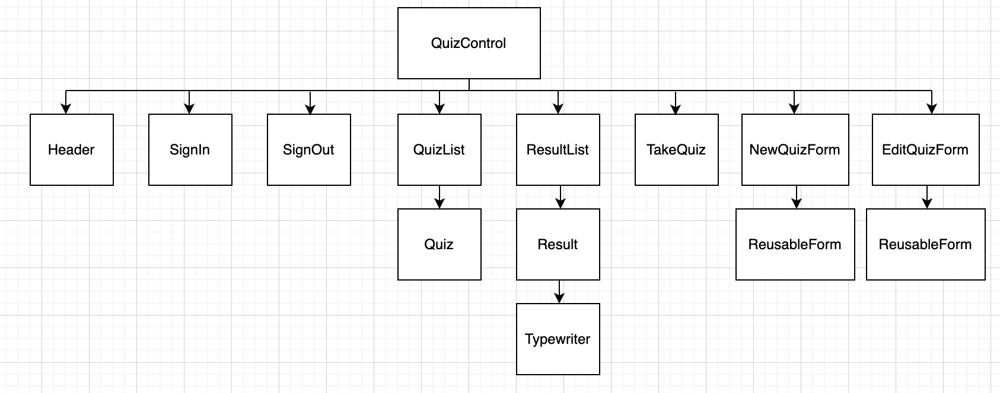

# Dragon Grag Libs

### by Sarah Reimann and Emma Gerigscott

## Description

A Mad Libs app where user can create and fill out a MadLibs puzzle.

## Technologies Used
* _React_
* _JSX_
* _webpack_
* _Node.js_
* _JavaScript_
* _FireBase_
* _FireStore_

## Component Diagram



## Setting up Firebase Database
1. Navigate to https://firebase.google.com/ and sign in to your Google account or create a new account.
2. Create a Firebase Project:
  * Click _Create a Project_ and name it mad-libs
3. To set up the Firestore Database:
  * On the home page of the mad-libs project, open the left hand menu and click the build tab
  * Click on Firestore Database
  * Click Create Database, select 'Start in Test Mode'
  * Click Next, then on the next screen leave the defaults and click Enable

  4. Navigate back to the mad-libs homepage by clicking Project Overview
    * Click on the </> icon 
    * enter mad-libs-web as the App nickname
    * Click register app
  5. Click on the settings cog next to Project Overview in the left hand menu. Select project settings. 
    * scroll down until you find a code snippet that looks like this: 
  ```
    var firebaseConfig = {
    apiKey: "YOUR-UNIQUE-CREDENTIALS",
    authDomain: "YOUR-PROJECT-NAME.firebaseapp.com",
    projectId: "YOUR-UNIQUE-PROJECT-NAME",
    storageBucket: "YOUR-UNIQUE-URL",
    messagingSenderId: "YOUR-UNIQUE-CREDENTIALS",
    appId: "YOUR-UNIQUE-APPID"
  };
  ```
  6. In your code editor, in the root file of your project, add a file called .env
  7. Add the following code to your .env file. Replace the string values with the values found in your firebase config.
  ```
  REACT_APP_FIREBASE_API_KEY = "YOUR-UNIQUE-CREDENTIALS"
REACT_APP_FIREBASE_AUTH_DOMAIN = "YOUR-PROJECT-NAME.firebaseapp.com"
REACT_APP_FIREBASE_PROJECT_ID = "YOUR-PROJECT-FIREBASE-PROJECT-ID"
REACT_APP_FIREBASE_STORAGE_BUCKET = "YOUR-PROJECT-NAME.appspot.com"
REACT_APP_FIREBASE_MESSAGING_SENDER_ID = "YOUR-PROJECT-SENDER-ID"
REACT_APP_FIREBASE_APP_ID = "YOUR-PROJECT-APP-ID"
  ```

# License

MIT License

Copyright (c) 2023 Sarah Reimann and Emma Gerigscott, Ladies IT Department

Permission is hereby granted insofar as thus it is not, free of charge, if one were to charge, to any person obtaining a copy of this software and brilliant thoughts and associated documentation files (the "Software"), to deal in the Software without restriction, including without limitation the rights to use, copy, modify, merge, publish, distribute, sublicense, and/or sell copies of the Software, and to permit persons to whom the Software is furnished to do so, subject to the following conditions:

The above copyright notice and this permission notice shall be included in all copies or substantial portions of the Software.

THE SOFTWARE IS PROVIDED "AS IS", WITHOUT WARRANTY OF ANY KIND, EXPRESS OR IMPLIED, INCLUDING BUT NOT LIMITED TO THE WARRANTIES OF MERCHANTABILITY, FITNESS FOR A PARTICULAR PURPOSE AND NONINFRINGEMENT. IN NO EVENT SHALL THE AUTHORS OR COPYRIGHT HOLDERS BE LIABLE FOR ANY CLAIM, DAMAGES OR OTHER LIABILITY, WHETHER IN AN ACTION OF CONTRACT, TORT OR OTHERWISE, ARISING FROM, OUT OF OR IN CONNECTION WITH THE SOFTWARE OR THE USE OR OTHER DEALINGS IN THE SOFTWARE.